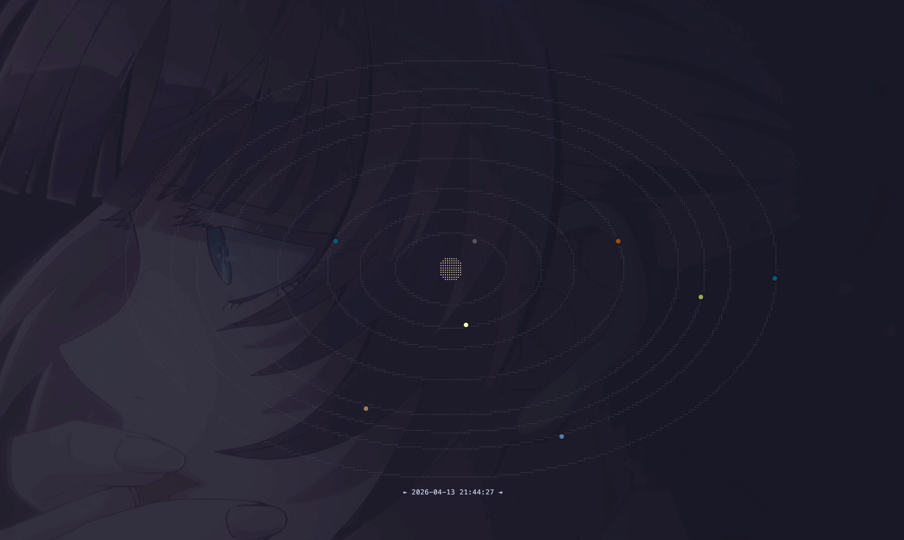

# solcl

A terminal based solar system viewer written in Go using [Bubble Tea](https://github.com/charmbracelet/bubbletea)



## Installation

```bash
go install github.com/cladamos/solcl@latest
```

If the command isn't recognized after installation, ensure your Go bin folder is in your PATH

## Usage

Simply run the command to see the solar system:

```bash
solcl
```

### Controls

- `q` or `ctrl+c`: Quit the application
- `+` or `↑`: Zoom in
- `-` or `↓`: Zoom out
- `h`: Hide help
- `H`: Hide all
- `r`: Reset time
- `s`: Edit speed
- `→`: Warp forward / Increase speed
- `←`: Warp backward / Decrease speed

## Note
The planet locations in this project were **manually calculated for learning purposes**. 

Because of the fundamental limitations of terminal environments, the distances are scaled proportionally to be visually pleasing rather than strictly 1:1 astronomically accurate.